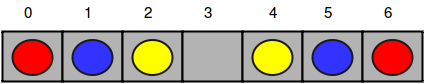
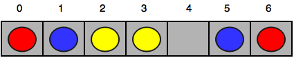
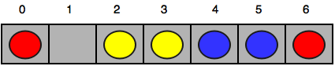

# Happy Ladybugs
Reference: [https://www.hackerrank.com/challenges/happy-ladybugs/problem](https://www.hackerrank.com/challenges/happy-ladybugs/problem)

Happy Ladybugs is a board game having the following properties:

- The board is represented by a string, $`b`$, of length $`n`$. The $`i^{th}`$ character of the string, $`b[i]`$, denotes the $`i^{th}`$ cell of the board.
    - If $`b[i]`$ is an underscore (i.e., _), it means the $`i^{th}`$ cell of the board is empty.
    - if $`b[i]`$ is an uppercase English alphabetic letter (ascii[A-Z]), it means the $`i^{th}`$ cell contains a ladybug of color $`b[i]`$.
    - String $`b`$ will not contain any other characters.
- A ladybug is happy only when its left or right adjacent cell (i.e., $`b[i\pm1]`$) is occupied by another ladybug having the same color.
- In a single move, you can move a ladybug from its current position to any empty cell.

Given the values of $`n`$ and $`b`$ for $`g`$ games of Happy Ladybugs, determine if it's possible to make all the ladybugs happy. For each game, print *YES* on a new line if all the ladybugs can be made happy through some number of moves. Otherwise, print *NO*.

As an example, $`b=[YYR_B_BR]`$. You can move the rightmost $`B`$ and $`R`$ to make $`b=[YYRRBB__]`$ and all the ladybugs are happy.

## Function Description

Complete the happyLadybugs function in the editor below. It should return an array of strings, either 'YES' or 'NO', one for each test string.

happyLadybugs has the following parameters:

- b: an array of strings that represents the initial positions and colors of the ladybugs

## Input Format

The first line contains an integer $`g`$, the number of games.

The next $`g`$ pairs of lines are in the following format:

The first line contains an integer $`n`$, the number of cells on the board.
The second line contains a string $`b`$ describing the $`n`$ cells of the board.

## Constraints

- $`1\leqg,n\leq100`$
- $`b[i]\in\{_,ascii[A-Z]\}`$

## Output Format

For each game, print *YES* on a new line if it is possible to make all the ladybugs happy. Otherwise, print *NO*.

## Sample Input 0

```
4
7
RBY_YBR
6
X_Y__X
2
__
6
B_RRBR
```

## Sample Output 0

```
YES
NO
YES
YES
```

## Explanation 0

The four games of Happy Ladybugs are explained below:

Initial board:



After the first move:



After the second move:



After the third move:


Now all the ladybugs are happy, so we print *YES* on a new line.

1. There is no way to make the ladybug having color *Y* happy, so we print NO on a new line.
2- There are no unhappy ladybugs, so we print *YES* on a new line.
Move the rightmost $`B`$ and $`R`$ to form $`b=[YYRRBB__]`$.

## Sample Input 1

```
5
5
AABBC
7
AABBC_C
1
_
10
DD__FQ_QQF
6
AABCBC
```

## Sample Output 1

```
NO
YES
YES
YES
NO
```