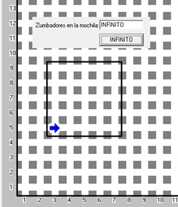
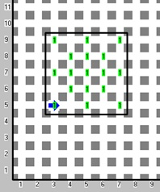

# Asterisco
Referencia: [https://www.cmirg.com/karelotitlan/Pantallas/Problema.aspx?id=12964](https://www.cmirg.com/karelotitlan/Pantallas/Problema.aspx?id=12964)

A Karel le han enseñado una nueva operación en la escuela: la multiplicación, y se ha obsesionado tanto con ella, que quiere practicar su símbolo (el asterisco) en todos los mundos que se le presenten.

## Problema

Ayuda a karel a practicar haciendo asteriscos en un cuadrado de longitud n donde lo único que se sabe es que n es impar.

## Consideraciones

- Hay una cantidad infinita de zumbadores en la mochila.
- Karel inicia dentro del cuadrado con posición y orientación desconocida.
- n está entre 5 y 55
- No importa la posición ni orientación final de Karel
- Lo único que se evaluará es que se haya formado correctamente el asterisco.

## Ejemplo

 Mundo de ejemplo | Solución al mundo de ejemplo
---|---
  | 
