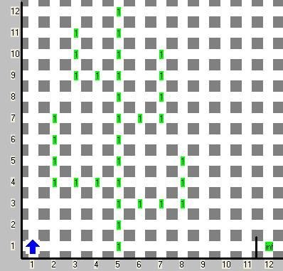
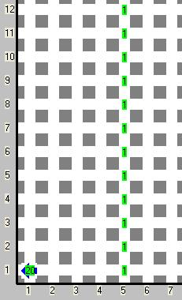

# Cactus
Referencia: [https://www.cmirg.com/karelotitlan/Pantallas/Problema.aspx?id=12849](https://www.cmirg.com/karelotitlan/Pantallas/Problema.aspx?id=12849)

Karel está pensando financiarse su viaje al mundial de fútbol para lo cual se le ocurrió vender las pencas de los cactus pero como el es cuidadoso de la naturaleza va a respetar el centro del cactus para que este pueda seguir creciendo. Por cada tramo de cactus Karel recibe 1 euro

## Problema

Tu tarea consiste en construir un programa que pode el cactus y calcule el número de euros que Karel puede obtener con dicho cactus.

## Consideraciones

- El cactus siempre crece para arriba y sus ramas (trozos a cortar) siempre crecen en forma de la letra L hacia arriba.
- La parte más alta del cactus (tanto del centro como de las ramas) siempre es menor a 50.
- La rama más baja inician a partir de una altura de 2.
- Nunca habrá dos ramas seguidas del mismo lado.
- El cactus siempre iniciara en el renglón número 1 y puede estar en cualquier columna a partir de la coordenada (1,1) y antes de la pared ubicada en la columna 12.
- Karel no tiene zumbadores (beepers) en la mochila.
- Karel siempre inicia en la coordenada (1,1).
- Después de la pared y pegada a ella siempre habrá un numero infinito de zumbadores (beepers).
- El cactus debe ser completamente podado.
- No importa la posición ni la orientación final de Karel.
- Karel debe dejar el resultado en la posición 1,1 y apagarse

## Ejemplo

 Mundo de ejemplo | Solución al mundo de ejemplo
---|---
  | 
