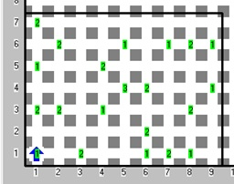

# La novia de Karel
Referencia: [https://www.cmirg.com/karelotitlan/Pantallas/Problema.aspx?id=12965](https://www.cmirg.com/karelotitlan/Pantallas/Problema.aspx?id=12965)

Karel ha organizado una fiesta, en la cual está invitando a sus amigos, familiares y a su novia.

Aunque Karel ha estado esperando a su novia toda la tarde, ha tenido que ir a la cocina para servir más botanas a sus invitados y ha descuidado la puerta por lo cual no pudo ver cuando entró su novia.

Como todo está a oscuras (para un mejor ambiente) tampoco la puede ver.

## Problema

Karel ha pedido tu ayuda para encontrar a su novia en sala de su casa, sabiendo que en la fiesta de karel hay amigos, familiares y su novia.

Los amigos están representados por montones de 1 zumbador, los familiares por montones de 2 zumbadores y su novia está representado por 3 zumbadores, Karel deberá encontrar a su novia y cuando la encuentre se deberá quedar con ella.

## Consideraciones

- Karel empieza a buscar en algún lado de la sala.
- La sala de karel tiene forma de un rectángulo regular.
- La novia de Karel no tiene celular.
- El tamaño de la sala es desconocido.
- Karel no deberá quitar de su lugar a sus invitados (zumbadores) ya que es de mala educación.
- Karel deberá apagarse cuando encuentre a su novia.
- La novia de karel es muy celosa.
- Karel tiene zumbadores infinitos en su mochila.
- No importa su orientación final.

## Ejemplo

 Mundo de ejemplo | Solución al mundo de ejemplo
---|---
  | 
