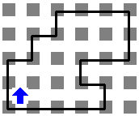
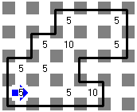

# Esquinas
Referencia: [https://www.cmirg.com/karelotitlan/Pantallas/Problema.aspx?id=12952](https://www.cmirg.com/karelotitlan/Pantallas/Problema.aspx?id=12952)

Al entrar a su casa, Karel, se dio cuenta que la decoración que tenía era muy antigua ya que no había ido a su casa de playa desde hacía mucho tiempo. Pero como todos sabemos, a Karel le gusta mucho las decoraciones exóticas y era de esperarse que la nueva decoración que piensa poner no sea algo común. Karel ha decido decorar su casa de tal manera que por cada esquina que se encuentre en su casa, tendrá que poner un montón de 5 zumbadores en ese lugar. Sin embargo también se sabe que la arquitectura de la casa de Karel es bastante irregular, por lo que en un determinado lugar puede haber más de una esquina.

## Problema

Ayuda a Karel a decorar su casa poniendo un montón de 5 zumbadores por cada esquina que se encuentre en la casa de Karel.

## Consideraciones

- La Casa de Karel tiene una forma muy extraña, la cual es un polígono irregular que no tiene paredes internas ni islas (pequeños polígonos adentro de la casa).
- Karel inicia en la esquina inferior izquierda más hacia el sur que existe en su casa y con orientación al norte.
- Después de decorar su casa, Karel irá al puerto a darse un “Chapuzón” con sus amigos.
- No se sabe cuántos zumbadores en la mochila tiene Karel, pero se asegura que al menos tendrá la cantidad exacta para realizar la tarea de decoración.
- No importa la posición ni orientación final de Karel, solo se tomará en cuenta que los zumbadores que hallan en el mundo sean los correctos.

## Ejemplo

 Mundo de ejemplo | Solución al mundo de ejemplo
---|---
  | 
