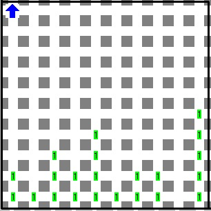

# Karel Mosby, arquitecto
Referencia: [https://www.cmirg.com/karelotitlan/Pantallas/Problema.aspx?id=12957](https://www.cmirg.com/karelotitlan/Pantallas/Problema.aspx?id=12957)

Karel Mosby está por terminar la carrera de arquitectura, como proyecto terminal debe dibujar el panorama urbano de la ciudad de Cuernavaca. El panorama urbano de una ciudad es la silueta que dibujan los edificios de la misma con el horizonte. Probablemente has visto en posters panoramas urbanos de ciudades como la Ciudad de México, Chicago o Nueva York.

Para dibujar el panorama urbano, Karel utiliza una vista superior de la ciudad. En la mitad superior del mundo de Karel hay montones de zumbadores que representan la vista de la ciudad desde arriba, la cantidad de zumbadores en cada montón representa la altura del edificio que hay en esa coordenada. En la mitad inferior Karel debe dibujar el panorama urbano utilizando montones de 1 zumbador.

## Problema

Ayuda a Karel a realizar su proyecto terminal.

## Consideraciones

- Karel inicia en la posición (1,1) con dirección norte.
- Karel inicia con 0 zumbadores en su mochila.
- El mundo de Karel siempre será rectangular
- La altura de los edificios será menor o igual a la mitad de la altura del mundo.
- El panorama urbano debe ser dibujado con montones de sólo 1 zumbador.
- No importa la posición ni la orientación final de Karel, sólo los lugares, en la mitad inferior del mundo donde dejaste zumbadores.

## Ejemplo

 Mundo de ejemplo | Solución al mundo de ejemplo
---|---
  | 

## Explicación al mundo de ejemplo

El lado izquierdo de la figura muestra el mundo inicial, la vista superior de la ciudad. El lado derecho de la figura muestra el panorama urbano dibujado por Karel.
