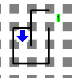
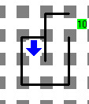

# Kontando en el Kallejón
Referencia: [https://www.cmirg.com/karelotitlan/Pantallas/Problema.aspx?id=12933](https://www.cmirg.com/karelotitlan/Pantallas/Problema.aspx?id=12933)

Karel está en un callejón que sólo tiene una salida y no tiene recovecos. Karel sabe que el final del callejón es un lugar donde hay un zumbador.

## Problema

¿Cuál es la cantidad mínima de instrucciones, entre gira-izquierda y avanza, que se necesitan para salir? Debes dejar un montón de zumbadores igual a esta cantidad en la casilla del zumbador de la salida (sin incluir éste).

## Consideraciones

- Karel tiene la cantidad suficiente de zumbadores para hacer su tarea en la mochila.
- Karel inicia en la entrada del callejón (no hay parte del callejón atrás de la posición inicial de Karel).
- No importa lo orientación o posición final de Karel.
- No habrá zumbadores dentro del callejón.

## Ejemplo

 Mundo de ejemplo | Solución al mundo de ejemplo
---|---
  | 

## Explicación al mundo de ejemplo

La forma de salir del callejón del caso de ejemplo es: avanza (1), gira-izquierda (2), avanza (3), gira-izquierda (4), avanza (5), avanza (6), gira-izquierda (7), gira-izquierda (8), gira-izquierda(9) y avanza (10).
