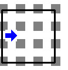
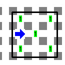

# ¡Tache!

Karel vive dentro de un cuadrado.

## Problema

Tu tarea consiste en poner un tache dentro del cuadrado.

## Consideraciones

- Karel tiene la cantidad suficiente de zumbadores para hacer su tarea en la mochila.
- No habrá paredes dentro del cuadrado.
- No habrá zumbadores dentro del cuadrado.
- La posición y orientación inicial de Karel es desconocida.
- Al terminar no importa la orientación ni posición de Karel.

## Ejemplo

 Mundo de ejemplo | Solución al mundo de ejemplo
---|---
  | 

## Agradecimiento

Se agradece al Comité de Informática del Estado de Aguascalientes (OMIAgs) el permiso para publicar este problema en nuestro sitio.

[Karelotitlán v1.2.6](http://www.cmirg.com/karelotitlan/Pantallas/Problema.aspx?id=12931)
por Félix Rafael Horta Cuadrilla
[Créditos](http://www.cmirg.com/karelotitlan/pantallas/AcercaDe.aspx)
