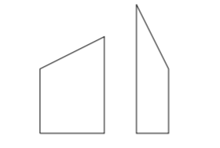
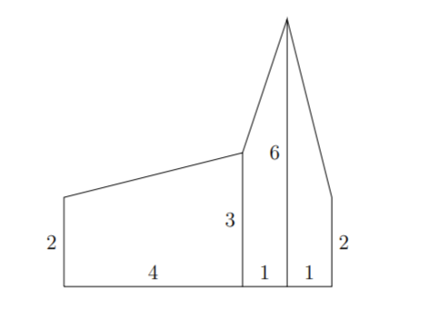
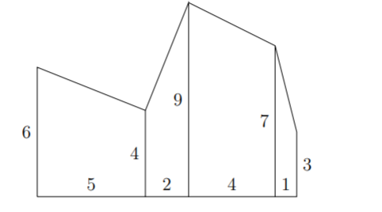

# Vallas locas

Reference: [https://omegaup.com/arena/CCC2021/#problems/S1-2021-Senior-CCC](https://omegaup.com/arena/CCC2021/#problems/S1-2021-Senior-CCC)

|                                  |        |                          |         |
| -------------------------------- | ------ | ------------------------ | ------- |
| Puntos                           | 100    | Límite de memoria        | 500 MiB |
| Límite de tiempo (caso)          | 3s     | Límite de tiempo (total) | 1m0s    |
| Tamaño límite de entrada (bytes) | 10 KiB |

## Descripción

Necesitas pintar una valla de madera entre tu casa y la de tu vecino. Necesitas determinar el área de la valla, para poder determinar cuánta pintura necesitas usar. Sin embargo, la valla está hecha de $`N`$ pedazos de madera no-uniformes, y tu vecino cree que tienen un toque artístico. En particular, las piezas de madera tienen distinta anchura. El lado inferior de cada pedazo de madera es horizontal, ambos lados serán verticales, pero la parte superior puede estar inclinada. A continuación se muestran dos pedazos de madera:

## Entrada

La primera línea de la entrada contiene un entero positivo $`N`$ donde $`N\leq10000`$.

La segunda línea de entrada contiene $`N+1`$ enteros separados por un espacio $`h_{i},...,h_{N+1}`$ $`(1 \leq h_{i} \leq 100, 1 \leq i \leq N+1)`$ describiendo las alturas de izquierda a derecha, de cada pieza de madera. Específicamente la altura izquierda de la i-ésima pieza de madera es $`h_{i}`$ y la altura derecha de la i-ésima pieza de madera es $`h_{i+1}`$. La tercera línea de la entrada contendrá $`N`$ enteros separados por un espacio $`w_{i}`$ $`(1 \leq w_{i} \leq 100, 1 \leq i \leq N)`$ describiendo el ancho de la -ésima pieza de madera.

## Salida

El área total de la valla.

## Ejemplo

| Entrada                          | Salida |
| -------------------------------- | ------ |
| 
3 2 3 6 2 4 1 1
 | 18.5   |

**Descripción**

Cuando vemos la valla de izquierda a derecha, las áreas individuales de las piezas de madera son de $`10=4 \times \frac{2+3}{2}`$, $`4.5=1 \times \frac{3+6}{2}`$, y $`4=1 \times \frac{6+2}{2}`$, para un área total de $`18.5`$.

La formula que se usa es:

1. $`b = Base`$
2. $`h_{1} = Altura Maxima`$
3. $`h_{2} = Altura Minima`$
4. $`b(h_{1}) + \frac{b(h_{1}-h_{2})}{2}`$
5. $`b(h_{1} + \frac{h_{1}-h_{2}}{2})`$
6. $`b(\frac{h_{1}+h_{2}}{2})`$

| Entrada                              | Salida |
| ------------------------------------ | ------ |
| 
4 6 4 9 7 3 5 2 4 1
 | 75     |

**Descripción**

Cuando vemos la valla de izquierda a derecha, las áreas individuales de las piezas de madera son de $`25`$, $`13`$, $`32`$, y $`5`$, para un área total de $`75`$.

## Límites

- $`N \leq 10000`$
- $`1 \leq h_{i} \leq 100, 1 \leq i \leq N+1`$
- $`1 \leq w_{i} \leq 100, 1 \leq i \leq N`$